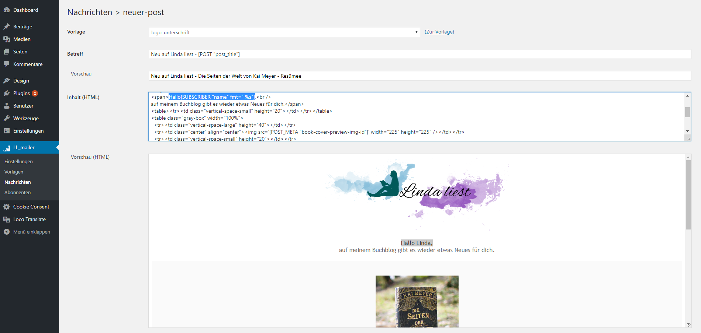
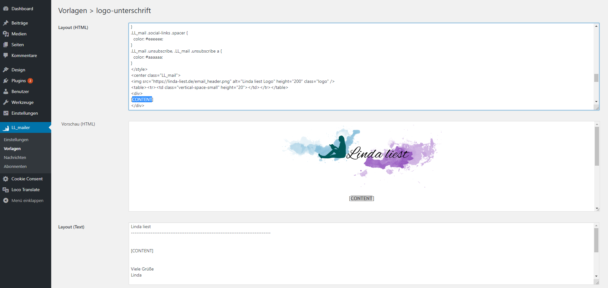
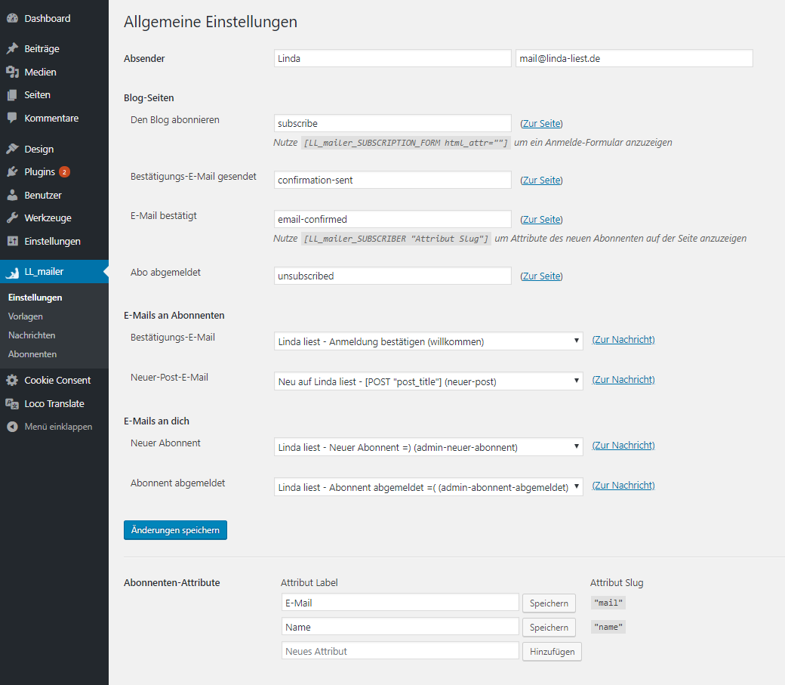

# LL mailer
*Wordpress new-post email notification plugin* (originally developed for [Linda liest](https://linda-liest.de))

###### On Page
- Shortcodes to customize pages
  - Subscription form
  - Subscriber attributes

###### WP-Admin Section
- Subscription
  - Form with custom subscriber attributes
  - Filters (subscriber-selectable post category groups)
  - Subscriber management
- Write (html and text version) templates to get a consistent look for all your mails
- Write (html and text version) mail "drafts"
- Live preview of messages with example subscriber/post data included
- Use custom shortcodes to include arbitrary data in your mails
  - WP_Post
  - Custom post meta
  - Subscriber attributes
  - Confirmation url (in subscription confirmation)
  - Unsubscribe url
  - Message content (only in templates)
  - In new post mail (if-like block whose contents are visible only in new-post mails)
- Send mails
  - when publishing a post, or for any already published post
  - manually, to any subscriber filter groups or a list of one-time email recipients

###### Themes/Plugins
- Use filters to further customize shortcode results before used in a mail
  - WP_Post (`LL_mailer_POST_attribute`)
  - Custom post meta (`LL_mailer_POST_META_attribute`)
  - Subscriber attributes (`LL_mailer_SUBSCRIBER_attribute`)

###### Used third-party libs
- *pelago/emogrifier* for automatic CSS inlining

###### Screenshots

